<div align="center">

# Real-Time Drone vs Bird Two-Stage Detection Pipeline


A real-time computer vision pipeline for **rotary-wing drone vs bird discrimination** using a two-stage YOLO-based architecture.
</div>
<p align="center">
  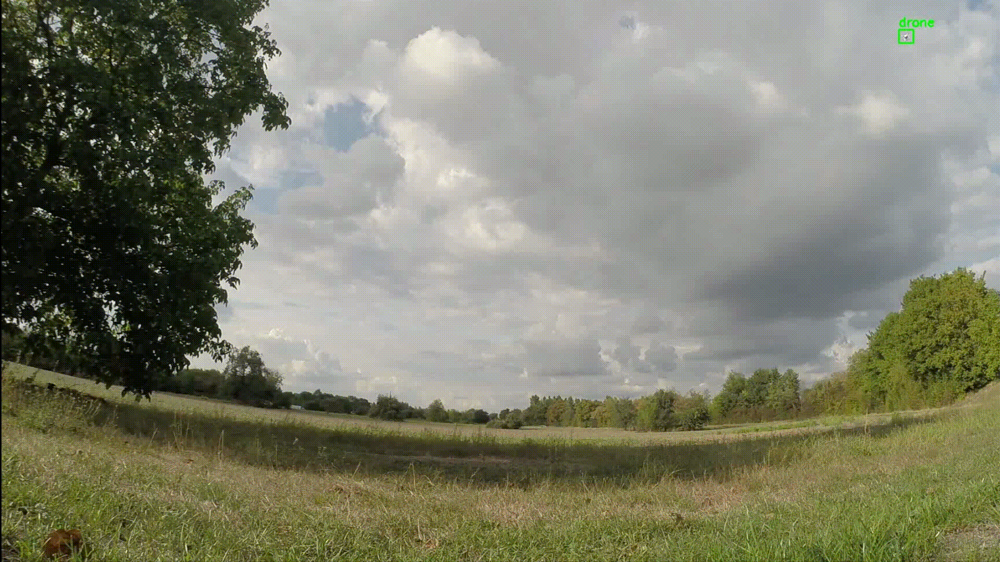
</p>

<p align="center">
  <b>Real-time drone/bird detection, crop-based classification, background rejection, and GUI-based video inference.</b>
</p>


A real-time computer vision pipeline for **rotary-wing drone vs bird discrimination** using a two-stage YOLO-based architecture.

The system first detects candidate flying objects with a single-class object detector and then classifies each detected crop as **drone**, **bird**, or **background** using a crop-based classifier. A PySide6-based graphical interface is provided for image and video inference, FPS monitoring, and visual inspection.

<p align="center">
  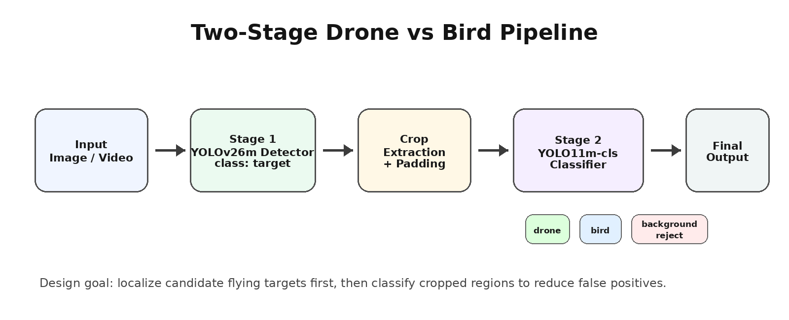
</p>

---

## Table of Contents

- [Overview](#overview)
- [Motivation](#motivation)
- [Key Features](#key-features)
- [System Architecture](#system-architecture)
- [Methodology](#methodology)
- [Dataset Summary](#dataset-summary)
- [Training Details](#training-details)
- [Results](#results)
- [GUI Application](#gui-application)
- [TensorRT Optimization Benchmark](#tensorrt-optimization-benchmark)
- [Installation](#installation)
- [Usage](#usage)
- [Project Structure](#project-structure)
- [Model and Dataset Availability](#model-and-dataset-availability)
- [Limitations](#limitations)
- [Future Work](#future-work)
- [License](#license)
- [Acknowledgements](#acknowledgements)

---

## Overview

Detecting small flying objects is a challenging computer vision problem due to:

- small object size,
- long-distance appearance,
- low contrast against the sky,
- motion blur,
- background clutter,
- visual similarity between drones and birds.

Instead of using a single object detector to directly classify every object as drone or bird, this project uses a **two-stage detection and classification pipeline**:

```text
Input Image / Video
        │
        ▼
Stage 1: YOLOv26m Detector
        │
        ├── Detects candidate flying objects as "target"
        ▼
Crop Extraction
        │
        ▼
Stage 2: YOLO11m-cls Classifier
        │
        ├── drone
        ├── bird
        └── background
        ▼
Final Visualization / GUI Output
```

The detector focuses on finding potential flying targets with a single generic class, while the classifier performs the final semantic decision on cropped target regions.

---

## Motivation

Drone-vs-bird discrimination is important in surveillance, airspace monitoring, and autonomous security systems. Birds can visually resemble small drones, especially at long distances or under poor lighting conditions. A detector trained only to find drones may produce false positives on birds, sky artifacts, tree edges, or other background regions.

This project addresses the problem with a more robust engineering approach:

1. **Detect first, classify later.**
2. **Use a dedicated classifier on cropped object regions.**
3. **Add a background class to reject false-positive detector outputs.**
4. **Provide a GUI-based video testing environment for practical evaluation.**

---

## Key Features

- Two-stage YOLO-based pipeline
- Single-class flying target detector
- Crop-based drone / bird / background classifier
- Background rejection for false-positive filtering
- PySide6 graphical user interface
- Image and video input support
- Batch crop classification for faster inference
- CUDA FP16 inference when available
- FPS and stage-level timing display
- Output image/video saving
- Clean project structure for research and portfolio use

---

## System Architecture

<p align="center">
  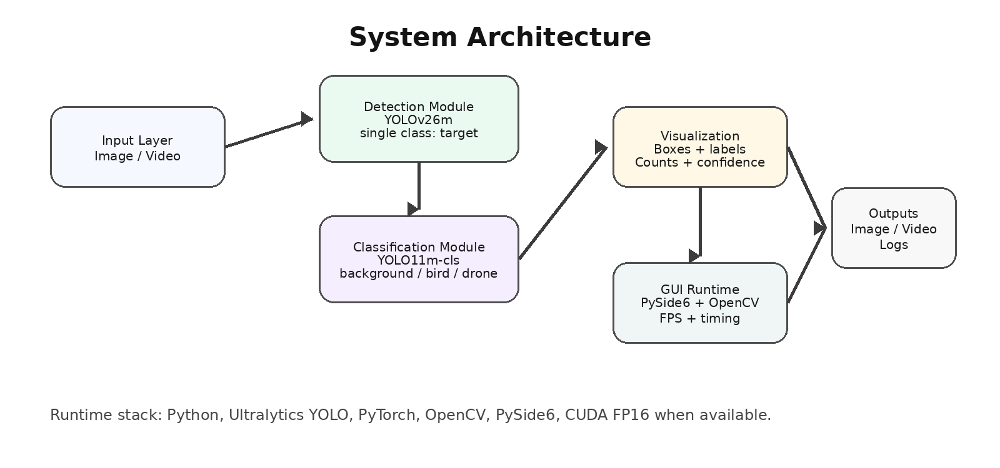
</p>

The pipeline consists of two main models:

| Stage | Model | Task | Output |
|---|---|---|---|
| Stage 1 | YOLOv26m | Object Detection | Candidate flying target bounding boxes |
| Stage 2 | YOLO11m-cls | Crop Classification | drone / bird / background |

The detector is intentionally trained with a single class called `target`. This avoids forcing the detection model to solve the fine-grained drone-vs-bird decision directly. The second-stage classifier receives cropped bounding box regions and performs the final classification.

---

## Methodology

### Stage 1 — Target Detection

The first stage uses a YOLOv26m object detector trained with a single class:

```text
0: target
```

Both drones and birds are represented as generic flying targets during detector training. The objective is to detect potential flying objects without directly separating them into drone or bird classes.

This design allows the detector to focus on localization and candidate generation.

---

### Stage 2 — Crop-Based Classification

For every bounding box produced by the detector:

1. The detected region is cropped from the original image.
2. Padding is added around the box to preserve contextual shape information.
3. The crop is resized to the classifier input size.
4. A YOLO11m-cls classifier predicts one of three classes:

```text
background
bird
drone
```

This second stage performs fine-grained visual discrimination.

---

### Background Rejection Strategy

A major issue in real-world inference is that object detectors may produce false positives on regions such as:

- sky texture,
- tree branches,
- grass,
- shadows,
- building edges,
- blurred background regions.

If the classifier only has `drone` and `bird` classes, every false-positive crop must be assigned to one of those two classes. This increases the final false alarm rate.

To solve this, a third class was added:

```text
background
```

False-positive crops generated by the detector were mined and added to the classifier dataset as negative examples. During inference, if the classifier predicts `background`, the detection is rejected and not displayed as a valid drone or bird target.

<p align="center">
  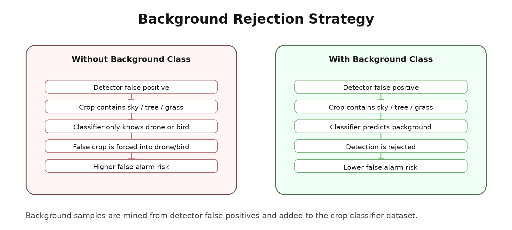
</p>

---

## Dataset Summary

### Dataset Source and Access Notice

This project was developed using a curated drone-vs-bird dataset structure derived from multiple sources, including internally prepared data and selected samples from the WOSDETC / Drone-vs-Bird Detection Challenge dataset.

The WOSDETC dataset is a broader challenge dataset and is **not redistributed** in this repository. It was obtained through a formal Data Usage Agreement and is subject to usage restrictions.

The dataset statistics reported below do **not** represent the full WOSDETC dataset. They refer only to the curated, project-specific subset and train/validation/test splits prepared for this work.

Users who want to access the original WOSDETC dataset should refer to the official WOSDETC challenge repository:

```text
https://github.com/wosdetc/challenge
```

According to the official WOSDETC repository, dataset access requests should be sent to:

```text
wosdetc@googlegroups.com
```

After the request is reviewed, users are required to sign a Data Usage Agreement before using the dataset for research purposes.

For this reason, this repository does **not** include:

- raw WOSDETC videos,
- extracted WOSDETC frames,
- original restricted dataset images,
- redistributed WOSDETC annotations,
- dataset download links,
- signed agreement documents,
- any private or restricted dataset material.

Only the project implementation, methodology, model architecture, training configuration, evaluation summaries, and public-safe visual outputs are included.

---

### Detector Dataset

The detector dataset was prepared as a project-specific, curated single-class object detection dataset.

Instead of directly separating drones and birds at the detection stage, both object types were represented as a generic flying target. This allows the detector to focus on candidate target localization, while the final drone/bird/background decision is handled by the second-stage classifier.

The following numbers represent the curated detector split used in this project.

| Split | Images |
|---|---:|
| Train | 7,044 |
| Validation | 1,244 |
| Test | 511 |

Detector class definition:

| Class ID | Class Name |
|---:|---|
| 0 | target |

---

### Classifier Training Dataset

The classifier dataset was created from cropped detector regions extracted from the curated project dataset. In addition to drone and bird crops, false-positive detector outputs were mined and added as a third `background` class.

This background class allows the system to reject detector false positives such as sky regions, tree edges, grass, shadows, blurred regions, and other non-target areas.

The following numbers represent the curated classifier training and validation splits used in this project.

| Split | Background | Bird | Drone | Total |
|---|---:|---:|---:|---:|
| Train | 2,000 | 4,601 | 5,338 | 11,939 |
| Validation | 300 | 817 | 905 | 2,022 |

Classifier class definition:

| Class Name | Description |
|---|---|
| background | Non-target false-positive crop |
| bird | Bird crop |
| drone | Rotary-wing drone crop |

---

### Classifier Evaluation Set

The classifier was also evaluated on a separate project-specific evaluation set that was not used as the training or validation split.

| Class | Images |
|---|---:|
| Background | 850 |
| Bird | 810 |
| Drone | 901 |
| **Total** | **2,561** |

## Training Details

### Detector Training Configuration

| Parameter | Value |
|---|---|
| Model | YOLOv26m |
| Task | Object Detection |
| Classes | 1 |
| Class name | target |
| Input size | 960 × 960 |
| Epochs | 100 |
| Optimizer | AdamW |
| Initial learning rate | 0.002 |
| Weight decay | 0.01 |
| Learning rate schedule | Cosine LR |
| Batch size | Auto |
| Early stopping patience | 25 |
| Training environment | Google Colab / CUDA GPU |

---

### Classifier Training Configuration

| Parameter | Value |
|---|---|
| Model | YOLO11m-cls |
| Task | Image Classification |
| Classes | background, bird, drone |
| Input size | 224 × 224 |
| Optimizer | AdamW |
| Learning rate schedule | Cosine LR |
| Input type | Cropped detector bounding boxes |

---

## Results

### Detector Performance

The YOLOv26m detector was evaluated on the validation set.

| Model | Class | Precision | Recall | mAP@50 | mAP@50-95 |
|---|---|---:|---:|---:|---:|
| YOLOv26m | target | 0.875 | 0.782 | 0.856 | 0.501 |

<p align="center">
  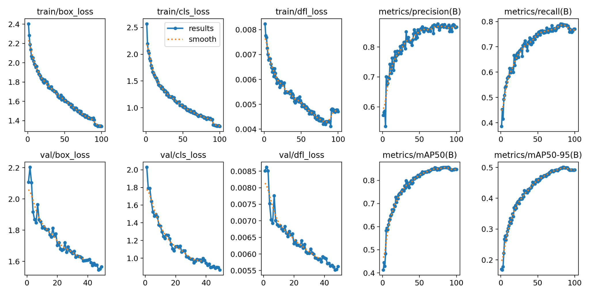
</p>

---

### Classifier Performance

The YOLO11m-cls classifier was evaluated on a separate evaluation set containing 2,561 cropped samples.

| Model | Classes | Evaluation Images | Top-1 Accuracy |
|---|---|---:|---:|
| YOLO11m-cls | background / bird / drone | 2,561 | 0.873 |

<p align="center">
  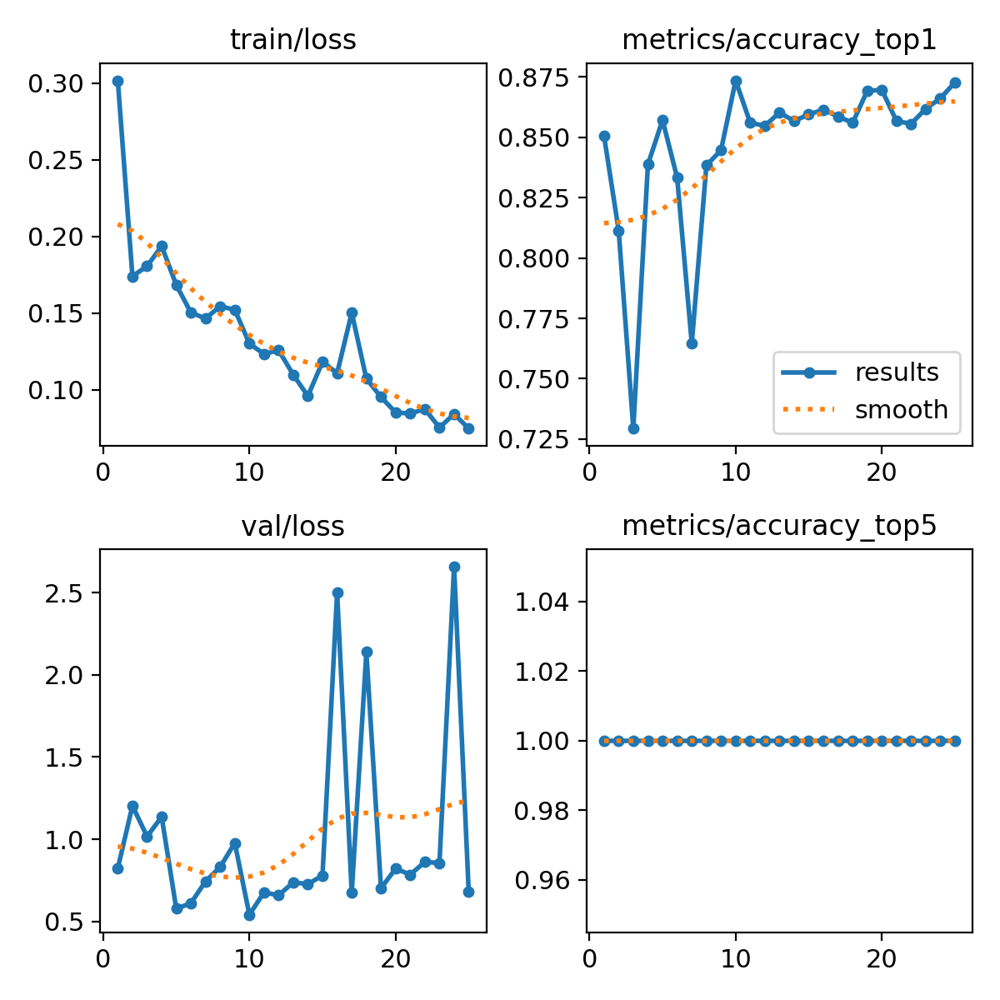
</p>

---

### Confusion Matrix

| Predicted \ True | Background | Bird | Drone |
|---|---:|---:|---:|
| Background | 567 | 7 | 10 |
| Bird | 173 | 782 | 3 |
| Drone | 110 | 21 | 888 |

<p align="center">
  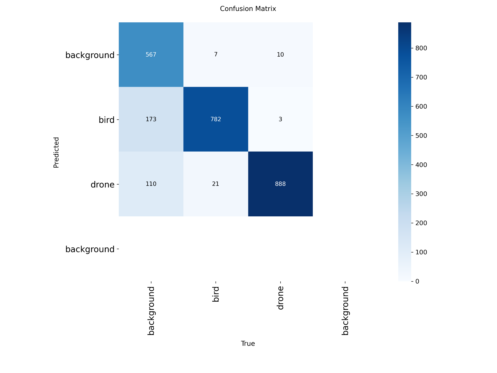
</p>

---

### Per-Class Evaluation Metrics

| Class | Precision | Recall | F1-score |
|---|---:|---:|---:|
| Background | 0.971 | 0.667 | 0.791 |
| Bird | 0.816 | 0.965 | 0.885 |
| Drone | 0.871 | 0.986 | 0.925 |
| **Macro Average** | **0.886** | **0.873** | **0.867** |

The classifier achieved strong recall for both drone and bird classes. The background class improves the system's ability to reject false-positive detector outputs. Most remaining errors are caused by visually ambiguous background regions being classified as bird or drone.

---

## Sample Outputs

<p align="center">
  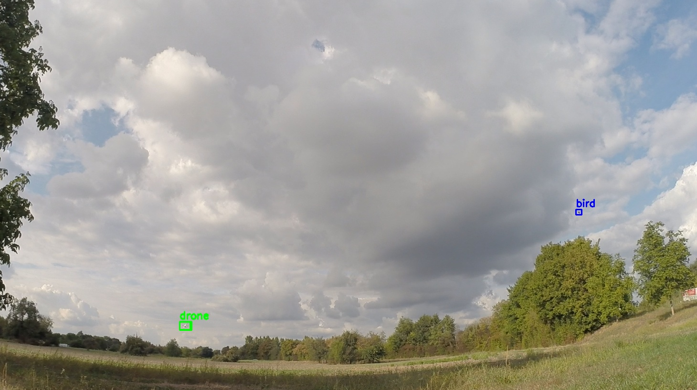
</p>

<p align="center">
  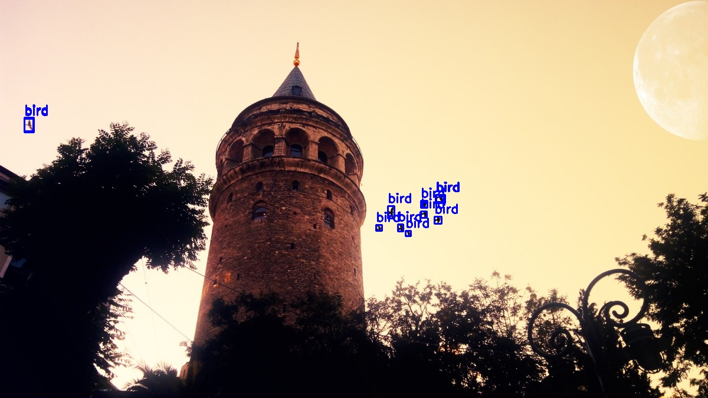
</p>

<p align="center">
  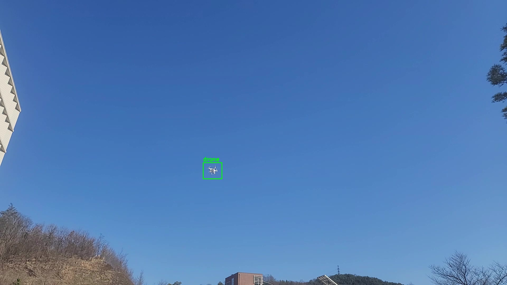
</p>

---

## GUI Application

A PySide6-based GUI is provided for practical testing on images and videos.

<p align="center">
  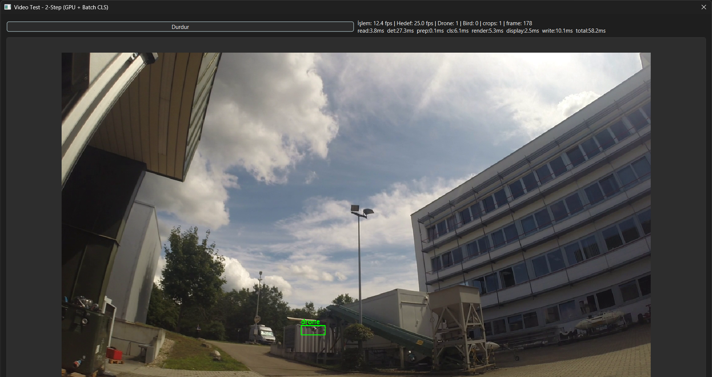
</p>

### GUI Features

- Select image files
- Select video files
- Drag-and-drop image support
- Run detector and classifier sequentially
- Display drone and bird counts
- Show or hide confidence scores
- Save annotated output images
- Save annotated output videos
- Display real-time FPS
- Display stage-level timing information:
  - frame read time
  - detection time
  - crop preparation time
  - classification time
  - rendering time
  - display time
  - video writing time
  - total frame processing time

---

## TensorRT Optimization Benchmark

TensorRT FP16 optimization was tested to evaluate real-time deployment performance. TensorRT engine files are not included in this repository because they are hardware-specific and can be large.

Benchmark environment:

| Item | Value |
|---|---|
| GPU | NVIDIA RTX 3060 Laptop GPU |
| CUDA | 12.6 |
| Precision | FP16 |
| Pipeline | Detector + crop classifier |

| Metric | PyTorch FP16 | TensorRT FP16 | Improvement |
|---|---:|---:|---:|
| FPS | 12.8 | 26.0 | 2.03× |
| Total latency | 87.0 ms | 44.8 ms | -48.5% |
| Detection latency | 25.2 ms | 18.9 ms | -25% |
| Classification latency | 15.4 ms | 2.6 ms | 5.9× faster |
| Render latency | 6.4 ms | 4.4 ms | -31% |
| Display latency | 3.0 ms | 1.9 ms | -37% |
| Write latency | 15.9 ms | 12.5 ms | -21% |

<p align="center">
  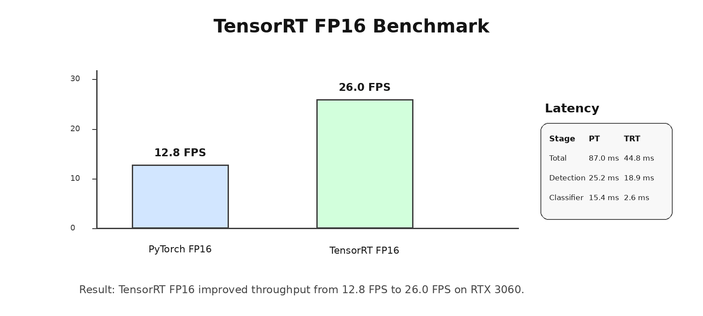
</p>

The TensorRT FP16 version exceeded the 25 FPS real-time target and reduced total latency by nearly half.

---

## Installation

### 1. Clone the Repository

```bash
git clone https://github.com/maliyildirim/drone-vs-bird-realtime-detection.git
cd drone-vs-bird-realtime-detection
```

### 2. Create a Virtual Environment

```bash
python -m venv .venv
```

Activate the environment:

```bash
# Windows
.venv\Scripts\activate
```

```bash
# Linux / macOS
source .venv/bin/activate
```

### 3. Install PyTorch

PyTorch installation depends on your operating system, Python version, GPU, and CUDA version.

For GPU inference, install the PyTorch build compatible with your CUDA version from the official PyTorch installation guide.

Example for CUDA 12.6:

```bash
pip install torch torchvision torchaudio --index-url https://download.pytorch.org/whl/cu126
```

For CPU-only usage:

```bash
pip install torch torchvision torchaudio
```

### 4. Install Project Requirements

```bash
pip install -r requirements.txt
```

### 5. Verify Installation

```bash
python -c "import torch; print('CUDA available:', torch.cuda.is_available())"
python -c "from ultralytics import YOLO; print('Ultralytics import successful')"
python -c "from PySide6.QtWidgets import QApplication; print('PySide6 import successful')"
```
## Usage

### Model Placement

Trained weights are not included in this repository. Place your trained models under the `models/` directory:

```text
models/
├── detector_yolov26m_target.pt
└── classifier_yolo11m_wbg.pt
```

Recommended naming:

| File | Description |
|---|---|
| `detector_yolov26m_target.pt` | Single-class target detector |
| `classifier_yolo11m_wbg.pt` | Drone / bird / background classifier |

---

### Run the GUI

```bash
python scripts/run_gui.py \
  --detector models/detector_yolov26m_target.pt \
  --classifier models/classifier_yolo11m_wbg.pt \
  --save-dir outputs
```

On Windows PowerShell:

```powershell
python scripts/run_gui.py `
  --detector models/detector_yolov26m_target.pt `
  --classifier models/classifier_yolo11m_wbg.pt `
  --save-dir outputs
```

---

### Run Image Inference

```bash
python scripts/run_image_demo.py \
  --image examples/sample_images/sample.jpg \
  --detector models/detector_yolov26m_target.pt \
  --classifier models/classifier_yolo11m_wbg.pt \
  --output outputs/sample_result.jpg
```

---

### Run Video Inference

```bash
python scripts/run_video_demo.py \
  --video examples/sample_videos/sample.mp4 \
  --detector models/detector_yolov26m_target.pt \
  --classifier models/classifier_yolo11m_wbg.pt \
  --output outputs/sample_result.mp4
```

---

## Configuration

Example detector configuration:

```yaml
detector:
  model_path: models/detector_yolov26m_target.pt
  image_size_image: 960
  image_size_video: 640
  confidence_threshold: 0.30
  iou_threshold: 0.60
  max_detections: 80
```

Example classifier configuration:

```yaml
classifier:
  model_path: models/classifier_yolo11m_wbg.pt
  image_size: 224
  min_confidence: 0.60
  classes:
    - background
    - bird
    - drone
```

Example GUI configuration:

```yaml
gui:
  save_dir: outputs
  display_scale: 0.75
  show_confidence: false
  video_frame_skip: 1
```

---

## Project Structure

```text
drone-vs-bird-two-stage-detection/
│
├── README.md
├── LICENSE
├── .gitignore
├── requirements.txt
│
├── assets/
│   ├── pipeline_overview.png
│   ├── system_architecture.png
│   ├── background_rejection.png
│   ├── detector_results.png
│   ├── classifier_results.png
│   ├── confusion_matrix.png
│   ├── gui_screenshot.png
│   ├── tensorrt_comparison.png
│   └── sample_outputs/
│
├── configs/
│   ├── detector.yaml
│   ├── classifier.yaml
│   └── gui_config.yaml
│
├── docs/
│   ├── methodology.md
│   ├── dataset.md
│   ├── training.md
│   ├── background_rejection.md
│   ├── gui_usage.md
│   └── tensorrt_optimization.md
│
├── src/
│   ├── detection/
│   │   └── detector.py
│   │
│   ├── classification/
│   │   └── classifier.py
│   │
│   ├── gui/
│   │   └── two_stage_gui.py
│   │
│   └── utils/
│       ├── crop_utils.py
│       ├── image_utils.py
│       └── visualization.py
│
├── scripts/
│   ├── train_detector.py
│   ├── train_classifier.py
│   ├── mine_background_crops.py
│   ├── run_gui.py
│   ├── run_image_demo.py
│   └── run_video_demo.py
│
├── models/
│   └── README.md
│
├── data/
│   └── README.md
│
├── examples/
│   ├── sample_images/
│   └── sample_videos/
│
└── outputs/
    └── .gitkeep
```

---

## Model and Dataset Availability

The trained model weights, TensorRT engine files, and full datasets are not included in this repository.

Reasons:

- model files are large,
- TensorRT engines are hardware-specific,
- dataset licensing may restrict redistribution,
- raw videos/images may contain project-specific material.

The repository provides the implementation, training scripts, inference pipeline, GUI application, and documentation required to reproduce or adapt the system.

```text
Code: MIT License
Dataset: Not included
Model weights: Not included
TensorRT engines: Not included
Demo media: Provided only when explicitly placed under assets/ or examples/
```

---

## Limitations

This project focuses on rotary-wing drone vs bird discrimination. The public version does not include datasets or results related to other UAV categories.

Known limitations:

- Very small objects may still be missed by the detector.
- Heavy motion blur can reduce both detection and classification accuracy.
- Background rejection depends on the diversity of mined false-positive samples.
- The classifier can only evaluate regions proposed by the detector.
- Thresholds may need adjustment for different cameras, altitudes, and environments.
- TensorRT engine files must be generated separately for the target hardware.

---

## Future Work

Planned improvements include:

- larger detector variants for improved small-object performance,
- more advanced background mining strategies,
- confidence threshold optimization,
- TensorRT export scripts,
- ONNX export support,
- ByteTrack-based persistent object ID tracking,
- motion trail visualization,
- target-level tracking metrics,
- deployment testing on NVIDIA Jetson platforms.

---

## License

This repository is released under the MIT License.

The MIT License applies only to the source code in this repository. Datasets, trained weights, TensorRT engine files, and demo media are not covered by the MIT License unless explicitly stated.

See the [LICENSE](LICENSE) file for details.

---

## Acknowledgements

This project was developed as a computer vision engineering study focused on real-time drone-vs-bird discrimination.

The implementation uses:

- Ultralytics YOLO
- PyTorch
- OpenCV
- PySide6
- NVIDIA CUDA / TensorRT ecosystem

---

## Author

**Muhammed Ali Yıldırım**

Electrical and Electronics Engineering  
Computer Vision & Embedded AI Systems
